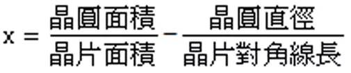
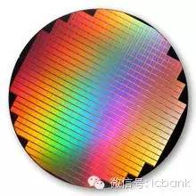
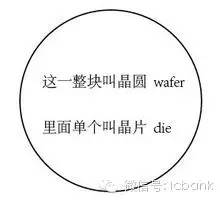
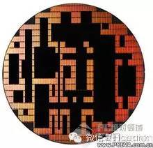
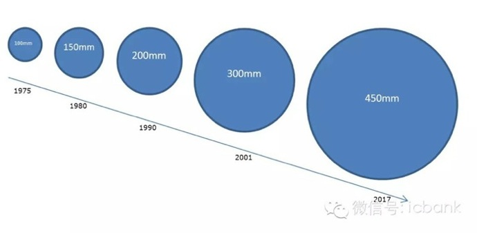

#####一片晶圆可以切多少个芯片
一片晶圆到底可以切割出多少的晶片vv数目？
这个要根据你的die的大小和wafer的大小以及良率来决定的。
目前业界所谓的6寸，12寸还是18寸晶圆其实就是晶圆直径的简称，只不过这个吋是估算值。实际上的晶圆直径是分为150mm，300mm以及450mm这三种，而12吋约等于305mm，为了称呼方便所以称之为12吋晶圆。

国际上Fab厂通用的计算公式：

聪明的读者们一定有发现公式中  π*(晶圆直径/2)的平方 不就是圆面积的式子吗？再将公式化简的话就会变成：

X就是所谓的晶圆可切割晶片数(dpw  die per wafer)。

那麽要来考考各位的计算能力了育！
假设12吋晶圆每片造价5000美金，那麽NVIDIA最新力作GT200的晶片大小为576平方公厘，在良率50%的情况下，平均每颗成本是多少美金？

**答案：USD.87.72**

####科普：wafer die chip的区别
我们先从一片完整的晶圆（Wafer）说起：

**一块完整的wafer**

#####名词解释
**wafer**即为图片所示的晶圆，由纯硅（Si）构成。一般分为6英寸、8英寸、12英寸规格不等，晶片就是基于这个wafer上生产出来的。Wafer上的一个小块，就是一个晶片晶圆体，学名**die**，封装后就成为一个颗粒。一片载有Nand Flash晶圆的wafer，wafer首先经过切割，然后测试，将完好的、稳定的、足容量的die取下，封装形成日常所见的Nand Flash芯片。那么，在wafer上剩余的，要不就是不稳定，要不就是部分损坏所以不足容量，要不就是完全损坏。原厂考虑到质量保证，会将这种die宣布死亡，严格定义为废品全部报废处理。

#####die和wafer的关系
品质合格的die切割下去后，原来的晶圆就成了下图的样子，就是挑剩下的Downgrade Flash Wafer。

#####筛选后的wafer
这些残余的die，其实是品质不合格的晶圆。被抠走的部分，也就是黑色的部分，是合格的die，会被原厂封装制作为成品NAND颗粒，而不合格的部分，也就是图中留下的部分则当做废品处理掉。

